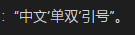

#教程 #obsidian #theme

# h1 Heading 标题

## h2 Heading 标题

### h3 Heading 标题

#### h4 Heading 标题

##### h5 Heading 标题

###### h6 Heading 标题

这是 ==高亮高亮== **加粗** 文本

使用 [煮豆黑体](https://github.com/Buernia/Zhudou-Sans) 并且开启 蝌蚪形逗号（ss02），~~balabala 划掉~~

↓ 开启 （《 ss02  》）  避免无法辨别 ：“中文‘单双’引号”。



↓ 添加图片边框避免无法识别图片边界


**副配色**：

#教程 #obsidian

Blockquotes 区块引用：

> Blockquotes 去掉斜体，使字体更加清晰易辨识
>
 >> ...by usin
>>
> > > ...or with spaces between arrows...

[欢迎](欢迎.md)  [[未创建]]  [链接文本](https://github.com/chenbihao/)    https://github.com/chenbihao/


测试 Tag 插件：

#theme #_theme   #the_me

#_教程  #_指南 #_参考

#_公司/阿里  #_公司/百度


## Images 图像


![[styleSetting.png]]

## query

```query
Inline
```

## Code 代码

### Inline 内联

`code code code`

### Indented code 缩进代码

    // Some comments
    line 1 of code
    line 2 of code
    line 3 of code

### Block code

```
Sample text here...
```

**jetbrains IDE** 相关配送示例（截取片段）：

### java

```java
/* Block comment */
import java.util.Date;
import static AnInterface.CONSTANT;

/**
 * Doc comment here for <code>SomeClass</code>
 * @param T type parameter
 */
@Annotation (name=value)  
public class SomeClass<T extends Runnable> { // some comment
  private T field = null;
  private double unusedField = 12345.67890;
  private UnknownType anotherString = "Another\nStrin\g";
  public static int staticField = 0;
  protected final int protectedField = 0;
  final int packagePrivateField = 0;

  /**
   * Semantic highlighting:
   *  Color#1 SC1.1 SC1.2 SC1.3 SC1.4 Color#2 SC2.1 SC2.2 SC2.3 SC2.4 Color#3
   * @param param1
   */
  public SomeClass(AnInterface param1,
                  int param2,
                  int param3) {
    int reassignedValue = this.staticField + param2 + param3;
    long localVar1, localVar2, localVar3, localVar4;
    reassignedValue ++; 
    field.run(); 
    new SomeClass() {
      {
        int a = localVar;
      }
    };
  }
}
enum AnEnum { CONST1, CONST2 }
interface AnInterface {
  int CONSTANT = 2;
  void method();
}
abstract class SomeAbstractClass {
  protected int instanceField = staticField;
}
```

### go

```go
/*
 * Go highlight sample
 */
//go:build (linux || windows) && arm
// +build linux,arm windows,arm

// Package main
package main

import "fmt"
import alias "fmt"

//go:generate go tool yacc -o gopher.go -p parser gopher.y

/*
Semantic highlighting:
*/
type (
	PublicInterface interface {
		PublicFunc() int
		privateFunc() int
	}
	demoInt int
	T struct {
		FirstName string `json:"first_name" arbitrary text`
	}
)

const (
	PublicConst  = 1
	privateConst = 2
)

func variableFunc(demo1 int, demo2 demoInt) {
	demo1 = 3
	a := PublicStruct{}
	a.PublicFunc()
	if demo1, demo2 := privateFunc(); demo1 != 3 {
		_ = demo1
		return
	}
	f := func() int {
		return 1
	}
	variableFunc(1, 2)
	println("builtin function")
}
func main() {
	const LocalConst = 1
	fmt.Println("demo\n\xA")
	alias.Println("demo")
	variableFunc(1, 2)
	var d, c *int = nil, nil
}
```

### sql

```sql
-- DDL section
create table crm.product (
  id numeric primary key,
  title varchar(255) character set utf8
);
-- DML section
insert into product
  values (1, 'Product1');

select count(*) from crm.product;
select id as ProductID, title as ProductName
  from crm.product where id = :id;

\set content `cat data.txt`
```

### xml

```xml
<?xml version='1.0' encoding='ISO-8859-1'  ?>
<!DOCTYPE index>
<!-- Some xml example -->
<index version="1.0" xmlns:pf="http://test">
   <name>Main Index</name>
   <indexitem text="rename" target="refactoring.rename"/>
   <indexitem text="move" target="refactoring.move"/>
   <indexitem text="migrate" target="refactoring.migrate"/>
   <indexitem text="usage search" target="find.findUsages"/>
   <indexitem>Matched tag name</indexitem>
   <someTextWithEntityRefs>&amp; &#x00B7;</someTextWithEntityRefs>
   <withCData><![CDATA[
          <object class="MyClass" key="constant">
          </object>
        ]]>
   </withCData>
   <indexitem text="project" target="project.management"/>
   <custom-tag>hello</custom-tag>
   <pf:foo pf:bar="bar"/>
</index>
```

### json

```json
{
  // Line comments are not included in standard but nonetheless allowed.
  /* As well as block comments. */
  "the only keywords are": [true, false, null],
  "strings with": {
    "no escapes": "pseudopolinomiality"
    "valid escapes": "C-style\r\n and unicode\u0021",
    "illegal escapes": "\0377\x\"
  },
  "some numbers": [
    42,
    -0.0e-0,
    6.626e-34
  ] 
}
```

### http

```http
@variable_name = 123 variable value 456\u2026
###
# Line comments started with hash symbol are allowed
// As well as comments started with two slashes
POST http://127.0.0.1:8080/add-value
Content-Type: application/json

{
  "name-key": "new-name",
  "content-key": "content"
}

### First separator's content is treaded as request name
### Other request separators can contain comments
POST http://{{host}}:8080/update-value?id={{item-id}} HTTP/2
Content-Type: application/json
X-Request-Id: {{$random.integer(10, 1000)}}

< ./input-file.json
```

## 空
