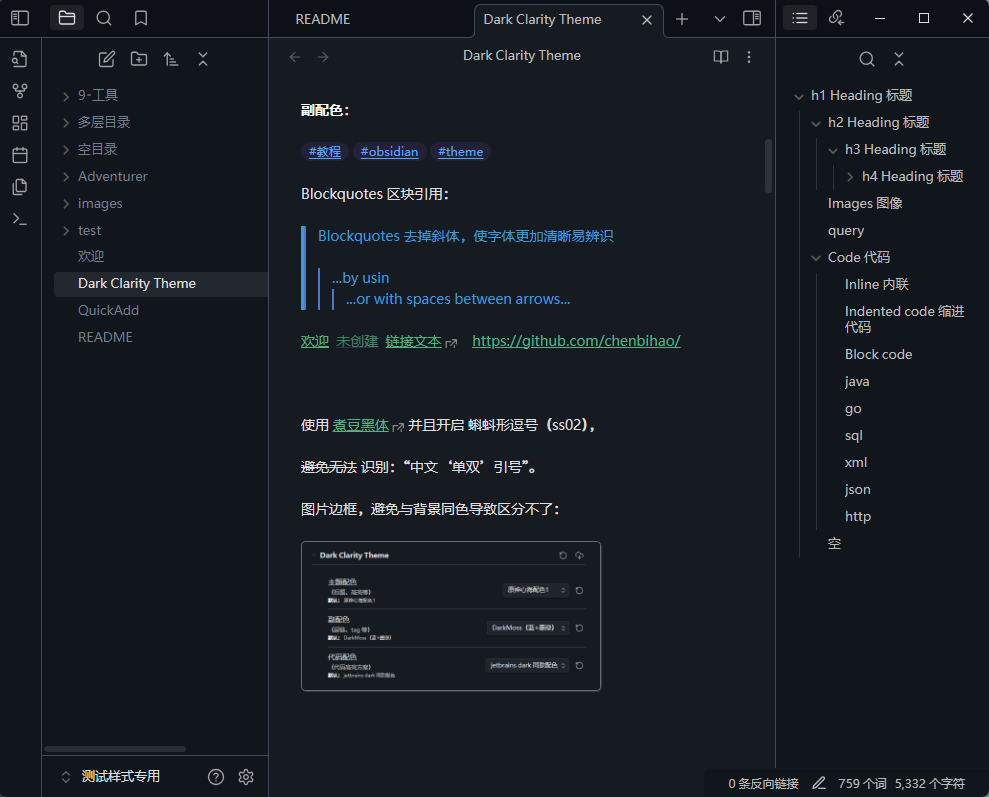

# README

## Dark Clarity Theme

一款 obsidian 的主题

### 高辨识、有配色

主要以 **高辨识度**、且 h1~h6 标题 **有主题色** 为主。

以 [Dark Moss](https://github.com/sergey900553/obsidian_githublike_theme) 部分内容为基底进行调整。

支持 Style Setting 插件，可自主选择 `主题配色`、`副配色`、`代码配色`。

多款主题配色：

- 原神系列 * N
- 新海诚系列
- Jay 叶惠美
- 简单彩虹

### 其他优化

本主题做出以下改变：

- 界面：左边栏横向滚动

- 字体：启用煮豆黑体的“蝌蚪形逗号”
- 文本：**粗体** 更明显
- 图片：加上了边框，清晰边界
- 引用块：去掉 *斜体*
- 代码块：
	- 尽可能统一渲染与编辑视觉
	- jetbrains IDE 同款配色
	- JetBrains Mono 同款字体
- 其他适配：
	- 当打印 pdf （浅配色）时，适当优化可见性

## 展示

### 支持 Style Setting 配置

可选空，则主题不生效

### 主题预览

### 左边栏滚动

## 主题配色

### 主配色

#### 原神心海配色

#### 原神心海配色2

#### 原神妮露配色

#### 原神甘雨配色

#### 原神神里绫华配色

#### 原神可莉配色

#### 原神希格雯配色

#### 原神砂糖配色

#### 铃芽之旅配色

#### Jay- 叶惠美配色

#### 简单彩虹

#### 更多主题配色详见 Style Setting 配置，这里不再列举

### 副配色

#### 默认副配色

### 代码配色

####  jetbrains IDE 同款配色

## 其他

### 字体

需要手动安装系统字体：[煮豆黑体](https://github.com/Buernia/Zhudou-Sans)、[JetBrains Mono](https://www.jetbrains.com/lp/mono)

不安装影响不大，煮豆黑体是为了兼容蝌蚪符号，详见下图的符号：

