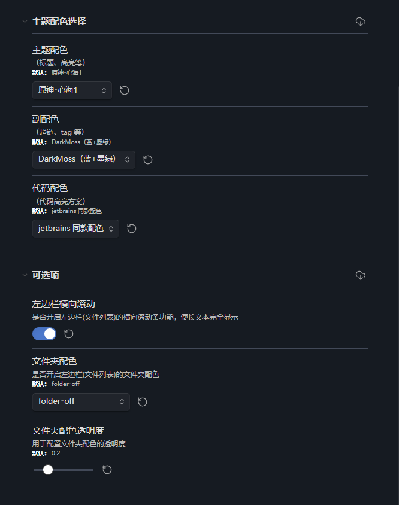
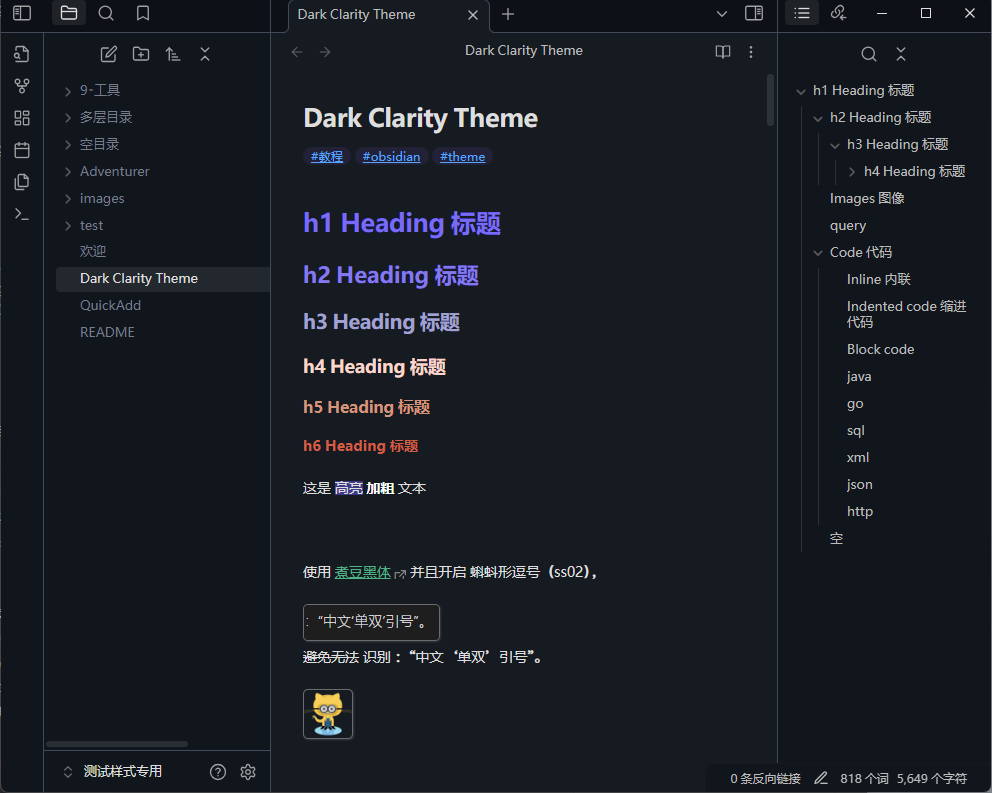
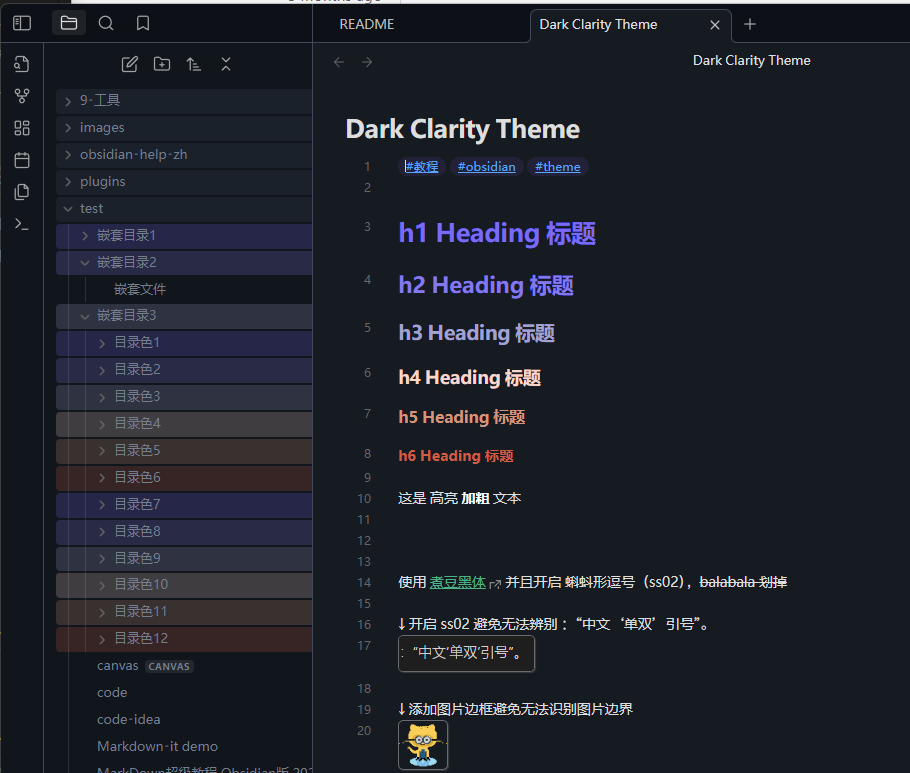

# README

## Dark Clarity Theme

**Dark Clarity**，一款 obsidian 的主题。

### 高辨识度、有配色

主要以 **高辨识度**、且 h1~h6 标题 **有主题色** 为主。

以 [Dark Moss](https://github.com/sergey900553/obsidian_githublike_theme) 部分内容为基底进行调整，并且进行了多处优化：

  - 多款配色选择
  - 浅色模式时的配色
  - 优化辨识度（粗体明显、图片边框、引用块去斜体）
  - 更多可选的优化功能

### 相关配置

#### 多款主题配色

- 原神系列 * N
- 新海诚系列
- 周杰伦系列
- 闪亮彩虹
- Nord

#### 多款副配色

- DarkMoss（蓝 + 墨绿）
- Nord 配套（霜冻蓝）

#### 代码配色

- jetbrains 同款配色（IDEA/GoLand）

#### 可选优化功能

- 左边栏横向滚动
- 左边栏文件夹配色

## 展示

### 支持 Style Setting 配置

**更多配置详见应用内 Style Setting 配置**

### 主题整体预览

### 左边栏滚动

### 左边栏文件夹配色（可选）

## 主题配色

### 主配色

#### 原神心海配色

#### 原神系列

#### 新海诚 - 铃芽之旅

#### 周杰伦 - 叶惠美

#### Nord-Aurora

#### 荧光彩虹

#### 更多主题配色详见 Style Setting 配置

### 副配色

#### DarkMoss（蓝 + 墨绿）

#### Nord 配套（霜冻蓝）

### 代码配色

####  jetbrains IDE 同款配色

## 其他

### 优化

本主题做出以下改变：

- 界面：左边栏横向滚动

- 字体：启用煮豆黑体的“蝌蚪形逗号”
- 文本：**粗体** 更明显
- 图片：加上了边框，清晰边界
- 引用块：去掉 *斜体*
- 代码块：
	- 尽可能统一渲染与编辑视觉
	- jetbrains IDE 同款配色
	- JetBrains Mono 同款字体
- 其他适配：
	- 支持浅色模式，优化辨识度，同时避免导出 PDF 时的可见性问题

### 字体

需要手动安装系统字体：[煮豆黑体](https://github.com/Buernia/Zhudou-Sans)、[JetBrains Mono](https://www.jetbrains.com/lp/mono)

不安装影响不大，煮豆黑体是为了兼容蝌蚪符号，详见下图的符号：

### 希望加入配色

提 issue，并把对应的 H1~H6 的颜色代码贴上来哦~ 如果配色优秀将添加进主题中~
